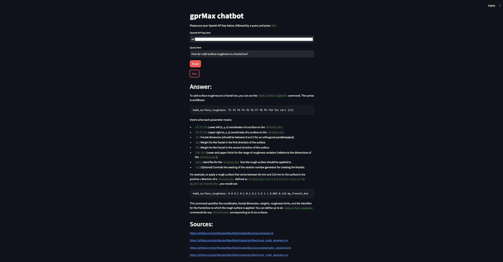

# Installation instructions

1. Open terminal and navigate to the directory you want to put the repo in
2. In the terminal type: `git clone [this repo]`
3. In the terminal type: `cd gprmax_chatbot`
4. In the terminal type: `conda env create -f environment.yml`
5. In the terminal type: `streamlit run streamlit.py`
6. In a browser, type into the address bar: `http://localhost:8501`

# Usage

You will need a valid OpenAI API key to use this chatbot

### OpenAI API Key

1. Sign up for an [OpenAI account](https://openai.com/index/openai-api/)

2. Navigate to the [API keys page](https://platform.openai.com/api-keys)

3. Select "+ Create new secret key", give it a name, and select "Create secret key"

The chatbot will ask you for your OpenAI API key, in order to access the OpenAI language models. 

### Using Streamlit

1. Put in your OpenAI API key

2. Put in your query

3. Press `Run`

# Example

