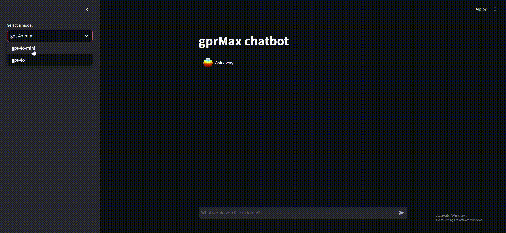
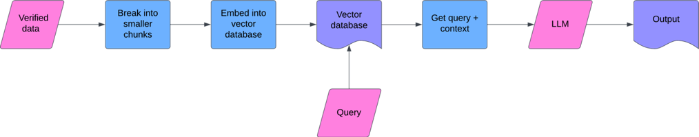
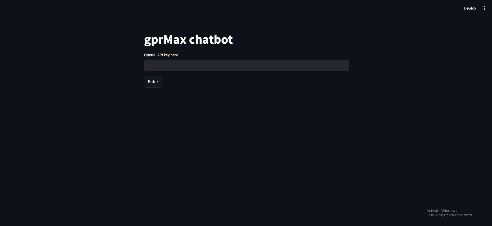
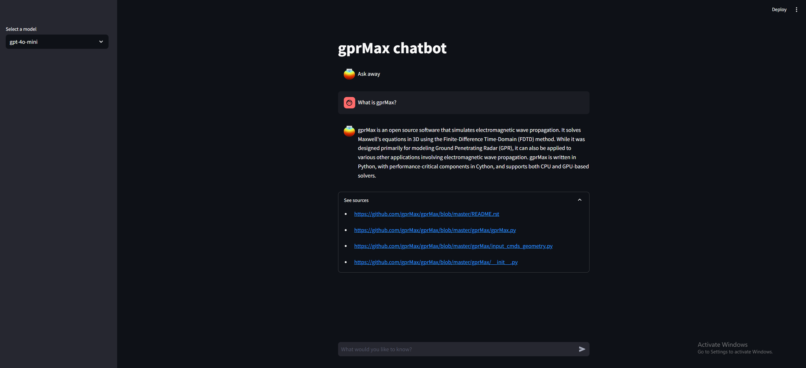
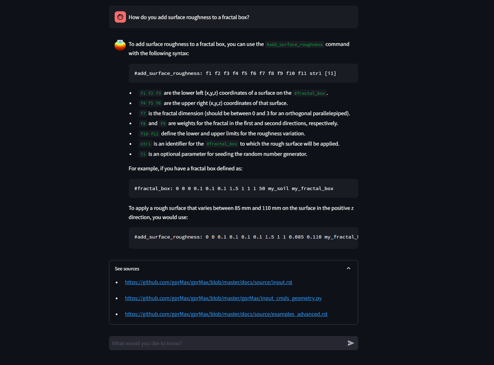
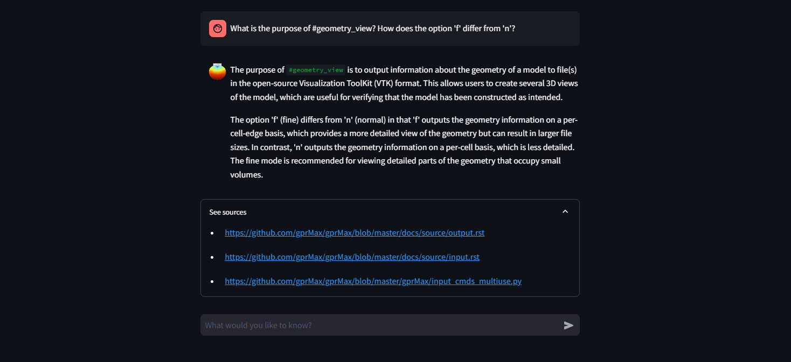

# Google Summer of Code 2024


### Project: [AI Chatbot and Assistant for Support](https://summerofcode.withgoogle.com/programs/2024/projects/DwjJyBl7)

This project aims to improve the user experience of gprMax, an open-source software for simulating electromagnetic wave propagation by modelling Ground Penetrating Radar (GPR) and electromagnetic wave propagation, through the development of an AI chatbot and assistant. The purpose of the AI chatbot is to answer and troubleshoot any questions that the gprMax users may have, while the AI assistant is capable of turning natural language into an input file in the required gprMax format. We leverage pretrained LLM models from OpenAI, the LangChain framework, RAG, and fine-tuning techniques, drawing on the existing gprMax documentation and years worth of discussion in the Google groups and the GitHub issue tracker for data. The ultimate goal is to deliver and deploy an AI chatbot and assistant to enhance the accessibility of gprMax, as well as save both the users and the development team valuable time by automating the troubleshooting process.

*Keywords: RAG, LangChain, LLM, Finetuning*

**Organisation:** [gprMax](https://summerofcode.withgoogle.com/programs/2024/organizations/gprmax)

**Contributor:** Jung Whan Lee (eddieleejw)

**Mentors:** Iraklis Giannakis, Antonis Giannopoulos


### For more details on the development of the chatbot, refer to my [**TextGPT** repository](https://github.com/eddieleejw/textgpt) developed alongside this chatbot, where you can:
 - Create chatbots based on any custom set of documents
 - Evaluate a chatbot's performance to select the best chatbot for your needs
 - Finetune base chat models (e.g. to use as your LLM layer)
 - Query your chatbots



# Contributions

Throughout the course of the project, I developed a training pipeline that performs the following:

- **Build** a new vector database
- **Update** an existing vector database
- **Query** the vector database using RAG + LLM
- **Evaluate** the performance of the resulting chatbot (RAG + LLM) to compare different chatbots and pick the highest performing one
- **Finetune** a base model, with the aim of using it as the LLM layer in the chatbot for greater control over the chatbout outputs

I used this training pipeline to build the vector database consisting of various documents about gprMax, such as official documentation and source code, which is stored in a Chroma database in `dbs/af6c69d5/db`.

I then used the [Streamlit](https://streamlit.io/) Python package to build a GUI to allow for user-friendly interaction with the pre-built database.

Furthermore, I built a GUI for the entire training pipeline, which can be freely accessed [here](https://github.com/eddieleejw/textgpt).


# How does it work?

### LLM

LLMs (or large language models) are AI models designed to understand and generate human language. These models are trained on large amounts of text, and recent advances in these models have led to powerful and accessible chatbots, such as [ChatGPT](https://chatgpt.com/), with which you can interact with and have a conversation. These chatbots can be used for many tasks including answering questions, telling stories, and even assisting with complex problem-solving.

However, as powerful as these models are, they are not free from drawbacks, one of the most prominent drawbacks being "hallucination".

### Hallucination

"Hallucination" refers to the possibility for a LLM model to generate information that is incorrect, misleading, or even entirely fabricated. This occurs because LLMs generate responses based on patterns learned from vast amounts of training data, as opposed to truly processing the meaning of the text it was trained on. Hence, when asked a question, it is likely that the model responds with an answer that is statiscally likely, but may not be correct. 

Hallucinations can be particularly rampant in those settings where the LLM is being asked about subjects which the LLM never (or rarely) encountered in its training data. Some examples of such settings are:

1. When the LLM is being asked on subjects which did not exist at the time the LLM was trained
    - For instance, a LLM trained in 2022 cannot know about events that occured in 2024 such as how many medals the US won in the 2024 olympics

2. When the LLM is being asked about niche or specialised topics
    - Highly specialised subjects would not be well represented in the data, such as very specific historical events or specific open source software

One approach to mitigate hallucination is RAG (or retrieval augmented generation).

### RAG

In retrieval augmented generation, retrieval-based methods are combined with generative LLM models to provide more accurate responses to queries on which the LLM may have otherwise hallucinated.

1. We start by hand-picking a collection of verified and accurate source documents from which we want the LLM response to be sourced.

2. We then embed small chunks of these documents in a [vector database](https://www.pinecone.io/learn/vector-database/).

3. At query-time, we use the vector database and retrieval-based methods such as a similarity search, to find document chunk(s) that are most relevant to the query.

4. The LLM is supplied with the query and the context (as well as additional instructions such as to simply reply with "I don't know" if the given context can't answer the query) and generates a response.





# Installation

1. Install [Docker](https://www.docker.com/) 
    - Confirm docker installation by opening terminal and typing `docker -v`. It should tell you your docker version
2. Open terminal and navigate to the directory you want to put the repo in
3. Make sure Docker is running
4. In the terminal type:
```
git clone https://github.com/eddieleejw/gprmax_chatbot.git
cd gprmax_chatbot
docker build -t gprmax-image .
```

Building the image may take a few minutes.


# Usage

## Launch

1. Open terminal and type `docker run -p 8501:8501 gprmax-image`
2. In a web browser, type into the address bar: `http://localhost:8501` (not `http://0.0.0.0:8501`)


## OpenAI API Key

You will need a valid OpenAI API key to use this chatbot

1. Sign up for an [OpenAI account](https://openai.com/index/openai-api/)

2. Navigate to the [API keys page](https://platform.openai.com/api-keys)

3. Select "+ Create new secret key", give it a name, and select "Create secret key"

The chatbot will ask you for your OpenAI API key on launch in order to access the OpenAI language models. These keys are only stored by the program temporarily and locally, never elsewhere. Keep your API key safe, as access to it will allow others to generate API calls on your behalf.




## Chatting

1. Select chat model from the drop down menu on the left
    - We recommend "gpt-4o-mini" for most queries, as it is the cheapest option while still being very powerful
    - "gpt-4o" is more powerful, but will cost more per use

2. Enter your query in the chat box

3. Click the "See sources" drop down to see the documents referred to by the chatbot




# Examples

### Example 1



### Example 2



# Final remarks

### Future work

- Input file generation
- Ability for users to leave feedback, which could be used to improve the underlying vector database

### Acknowledgements

I would like to acknowledge and thank the gprMax team for their advice and encouragement throughout the project, and my primary mentors for their support and guidance.

I would also like to thank Google Summer of Code for organising this program and providing this opportunity to learn and contribute.